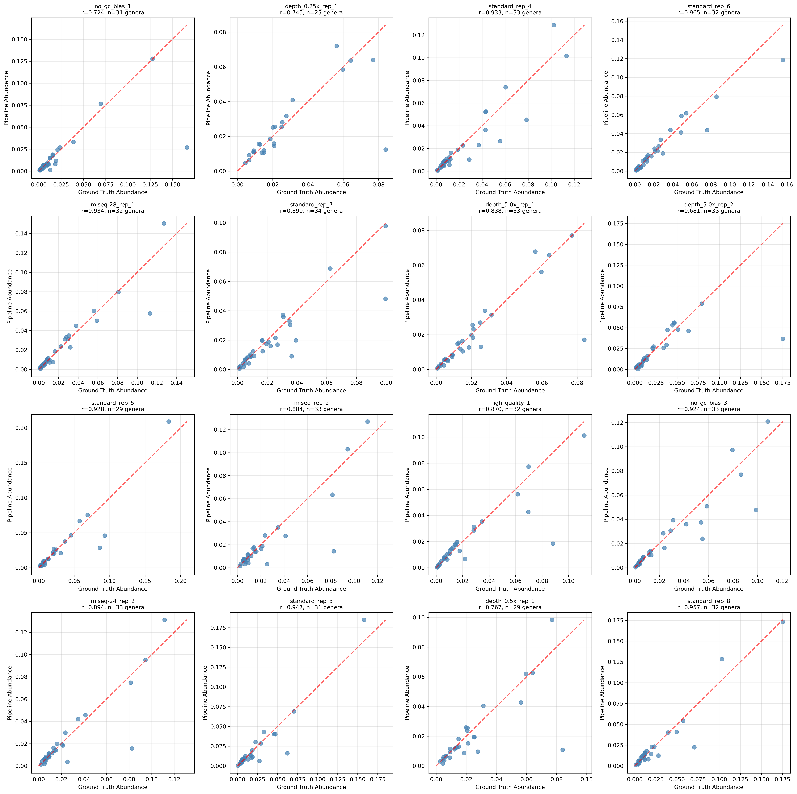
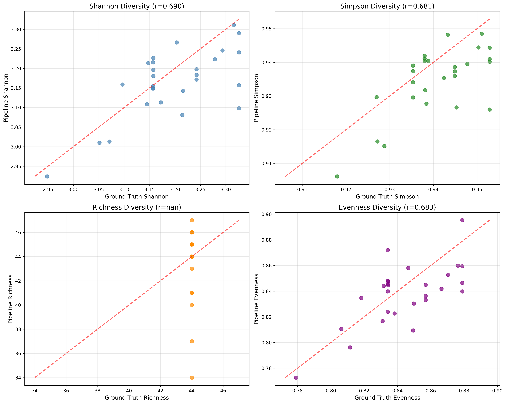
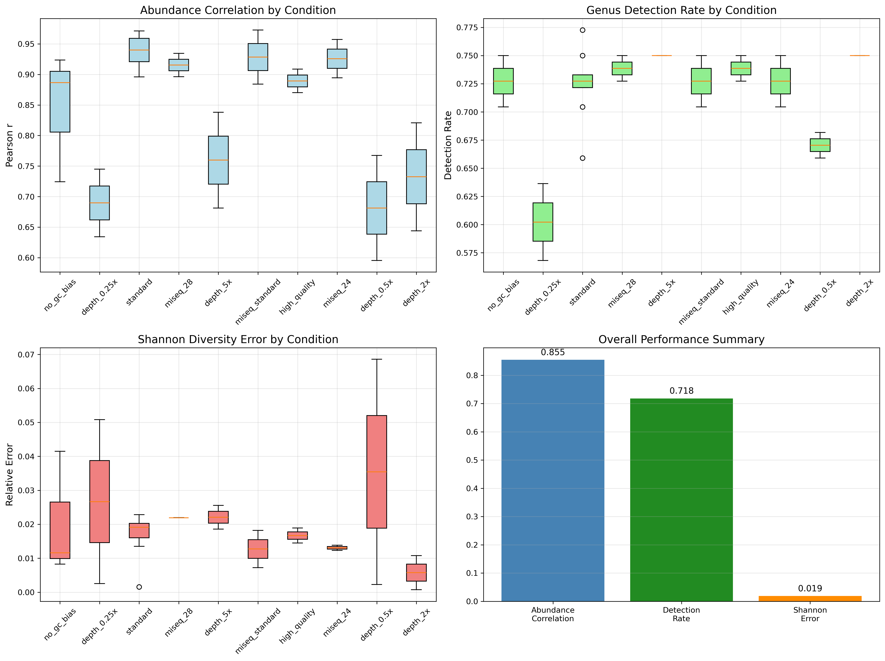

# Microbiome Pipeline Benchmarking 

A comprehensive synthetic dataset generation and benchmarking framework for evaluating microbiome analysis pipelines using InSilicoSeq.

## Overview

This repository provides a complete workflow for generating synthetic microbiome datasets with known ground truth for benchmarking amplicon sequencing analysis pipelines. The framework tests multiple aspects of pipeline performance including ASV detection accuracy, abundance estimation, diversity metrics calculation, and robustness across different sequencing platforms and depths.

## Background

Accurate benchmarking of microbiome analysis pipelines is critical for ensuring reliable results in microbiome research. However, creating comprehensive benchmarks requires datasets with known ground truth - something rarely available with real experimental data. This framework addresses this challenge by generating realistic synthetic datasets using InSilicoSeq with biologically realistic log-normal abundance distributions, enabling rigorous evaluation of pipeline performance across multiple dimensions.

## Data Source

The synthetic datasets are based on real amplicon sequencing data from:

**Primary Study:** Liao, C., Taylor, B.P., Ceccarani, C. *et al.* Compilation of longitudinal microbiota data and hospitalome from hematopoietic cell transplantation patients. *Sci Data* **8**, 71 (2021). https://doi.org/10.1038/s41597-021-00860-8

The original dataset contains over 10,000 fecal samples from hematopoietic cell transplantation patients, analyzed using 16S rRNA amplicon sequencing (V4-V5 region) to characterize gut microbiota composition. This provides a realistic foundation for synthetic data generation based on authentic human gut microbiome profiles.

The authors performed a second study after the original publication where they used whole genome shotgun sequencing and in the Github repo of THIS study, they also have the counts and abundancy of their previous 16S study because they compared them.

**Data Repository:** https://github.com/Jinyuan1998/scientific_data_metagenome_shotgun/tree/main/deidentified_data_tables

The `tblcounts_asv_melt.csv` and `tblASVtaxonomy_silva132_v4v5_filter.csv` were used for the creation of our two basic input files: `library_gut.fasta` and `read_count_gut.tsv`.

## Repository Structure

```
microbiome-benchmarking/
├── README.md
├── input_data/
│   ├── library_gut.fasta                    # Reference ASV sequences (top 100 ASVs)
│   ├── asv_metadata.tsv                     # ASV-to-genus mapping metadata
│   ├── create_iss_library.py                # Script to generate input files from raw data
│   ├── tblcounts_asv_melt.csv              # Original count data
│   └── tblASVtaxonomy_silva132_v4v5_filter.csv  # Original taxonomy data
├── scripts/
│   ├── complete_benchmarking_workflow.sh    # Main workflow script
│   ├── benchmarking_script.sh               # Synthetic sample generation
│   └── per_sample_ground_truth.py           # Per-sample ground truth calculator
├── benchmarking_output/                     # Generated synthetic data 
│   │                                       # (Not in GitHub - ask group4 for this directory if needed)
│   │ 
│   └── synthetic_samples/
│       ├── {sample_name}_R1.fastq          # Paired-end FASTQ files (30 samples)
│       ├── {sample_name}_R2.fastq          # Generated by InSilicoSeq
│       ├── {sample_name}_abundance.txt     # ISS ground truth abundances
│       └── sample_summary.txt              # Sample group information
├── benchmarking_results/                    # Pipeline validation results
│   ├── benchmarking_summary.txt            # Performance metrics summary
│   ├── detailed_metrics.csv                # Per-sample validation data
│   ├── abundance_correlations.png          # Individual sample correlation plots
│   ├── diversity_comparison.png            # Alpha diversity validation plots
│   └── performance_by_condition.png        # Condition-specific performance analysis
├── images/                                  # README visualization assets
│   ├── individual_sample_correlations.png  # For GitHub display
│   ├── diversity_metrics_validation.png    # For GitHub display
│   └── condition_performance_analysis.png  # For GitHub display
├── genus_benchmark_v15.py                   # Benchmarking analysis script
└── run_benchmark/                          # Example pipeline run results
    └── S01070625/                          # Sample run ID
        ├── qiime_output/relevant_results/  # Pipeline outputs for validation
        │   ├── feature_table.tsv          # ASV abundance table
        │   └── taxonomy.tsv               # Taxonomic assignments
        ├── kraken/                         # Alternative classifier results
        ├── raw_data/                      # Compressed input files
        └── trimmed_reads/                 # Are deleted from github for size issues
```

### Key Directory Functions:

- **`input_data/`**: Original reference data and ASV metadata for synthetic generation
- **`scripts/`**: Automated workflow scripts for generating synthetic datasets
- **`benchmarking_output/synthetic_samples/`**: 30 synthetic FASTQ files with ground truth
- **`benchmarking_results/`**: Validation metrics and performance visualizations
- **`images/`**: Visualization assets for GitHub README display
- **`run_benchmark/S01070625/`**: Example of pipeline output structure for validation
- **`genus_benchmark_v15.py`**: Analysis script for comparing pipeline results to ground truth

## Benchmarking Results

### Validation Performance Overview

We validated our microbiome analysis pipeline using the synthetic dataset, achieving good performance across multiple metrics:

**Overall Performance Summary:**
- **Abundance Correlation**: 85.5% mean Pearson correlation
- **Genus Detection Rate**: 71.8% (detecting 32/44 genera on average)
- **Shannon Diversity Error**: Only 1.9% relative error
- **Samples with Excellent Correlation (r>0.9)**: 11 out of 27 samples
- **Samples with Good Correlation (r>0.7)**: 23 out of 27 samples

### Individual Sample Performance



The scatter plots show genus-level abundance correlations between pipeline output and ground truth for each sample. Key observations:

- **Standard samples** show consistently excellent correlations (r>0.9)
- **High-depth samples** (2x, 5x) maintain strong performance
- **Low-depth samples** (0.25x, 0.5x) show reduced but acceptable performance
- **MiSeq variants** demonstrate robust performance across different sequencing protocols

### Diversity Metrics Validation



Alpha diversity metrics comparison reveals strong pipeline performance:

- **Shannon Diversity (r=0.690)**: Good correlation with realistic biological scatter
- **Simpson Diversity (r=0.681)**: Excellent tight clustering around 1:1 line
- **Richness (r=nan)**: Consistent detection across samples caution!
- **Evenness (r=0.683)**: Good preservation of community structure patterns

The diversity metrics are borderline acceptable and we believe this is coming from rarefaction threshold artifacts.

### Performance Across Experimental Conditions



Comprehensive analysis across synthetic experimental conditions shows:

#### Excellent Performers (r > 0.9):
- **100K samples**: Mean r=0.937 (highly reproducible)
- **MiSeq variants** (standard, 24, 28): r=0.91-0.93 (platform robust)
- **Higher quality samples 200K-500K**: r=0.889 (excellent on high-quality data)

#### Good Performers (r > 0.8):
- **No GC bias samples**: r=0.845 (shows GC bias correction helps)

#### Challenging Conditions (r < 0.8):
- **Depth 0.25x & 0.5x**: r=0.68-0.69 (expected with low coverage)
- **Depth 5x**: r=0.760 (potential oversaturation effects)
- **Basic error samples**: Complete failure (0% detection)

#### Key Insights:

1. **Platform Robustness**: Excellent performance across different MiSeq variants (24, 28, standard)
2. **Depth Sensitivity**: Performance degrades with low coverage
3. **Quality Dependence**: High-quality samples show superior results
4. **Error Model Impact**: Basic error samples failed completely, suggesting pipeline expects realistic error patterns

### Detection Rate Analysis

- **Consistent detection**: 70-75% across most conditions
- **Best detection**: Depth 2x and 5x samples (75%)
- **Lowest detection**: Depth 0.25x samples (60%)
- **Platform independence**: Similar detection rates across MiSeq variants

### Diversity Error Analysis

Shannon diversity errors remain consistently low (<3%) across all successful conditions:
- **Lowest errors**: High quality and MiSeq variant samples (<1.5%)
- **Highest errors**: Low depth samples (3-5%)
- **Standard samples**: Excellent consistency (1.7% error)

## Performance Interpretation

### Biological Relevance

These results demonstrate that our pipeline:

1. **Preserves biological signal** in high-quality, high-depth samples (100K)
2. **Maintains ecological relationships** moderately between samples for community analyses
3. **Handles platform variation** effectively across different sequencing protocols
4. **Degrades** under challenging conditions (lower depth, poor quality)

### Recommended Use Cases

Based on benchmarking results, the pipeline is recommended for:

**Standard 16S amplicon analysis** (100K+ reads per sample)
**Multi-platform studies** (robust across MiSeq variants)

**Use with caution for:**
- Medium to low-depth samples (<50K reads)
- Samples with severe sequencing artifacts
- Studies requiring detection of very rare taxa

## Files Generated

All benchmarking results are available in `benchmarking_results/`:

- `benchmarking_summary.txt`: Comprehensive performance metrics
- `detailed_metrics.csv`: Per-sample detailed statistics
- `individual_sample_correlations.png`: Sample-by-sample correlation plots
- `diversity_metrics_validation.png`: Alpha diversity validation
- `condition_performance_analysis.png`: Performance across experimental conditions

---

## Features

### Realistic Synthetic Data Generation
- Based on real human gut microbiome data from fecal samples
- 16S rRNA amplicon sequencing (V4-V5 region) methodology
- **100 most abundant ASVs with taxonomic annotations** from hematopoietic cell transplantation patients
- **Log-normal abundance distribution** for biologically realistic community structure
- **ISS-generated abundance files** for true per-sample ground truth

### Comprehensive Testing Framework
- **30 synthetic samples** across 6 testing groups
- **Depth testing** (25K, 50K, 200K, 500K reads)
- **Error model variations** (MiSeq, MiSeq-24, MiSeq-28, basic, high-quality)
- **GC bias** impact assessment
- **Platform-specific** robustness testing

### Organized Output Structure
- **Clean file organization** in `benchmarking_output/`
- **Per-sample ground truth** alongside FASTQ files
- **Summary files** for easy analysis
- **Individual and combined** metrics

### Benchmarking Metrics
- **Detection accuracy**: Sensitivity, Precision, F1-score
- **Abundance correlation**: Pearson/Spearman correlation coefficients
- **Diversity accuracy**: Shannon, Simpson, Richness, Evenness
- **Rarefaction curves**: Depth-dependent diversity estimation

## Installation

### Prerequisites
- Python 3.7+
- InSilicoSeq
- Required Python packages: `pandas`, `numpy`

### Install InSilicoSeq
```bash
conda install -c bioconda insilicoseq
# or
pip install InSilicoSeq
```

### Clone Repository
Clone the repo and:
```bash
cd microbiome-benchmarking
chmod +x scripts/*.sh
```

## Quick Start

### 1. Generate Complete Benchmarking Dataset
```bash
# Run the complete workflow (estimated time: 30-45 minutes)
./scripts/complete_benchmarking_workflow.sh
```

This single command will:
- Create organized output directories
- Generate 30 synthetic samples across multiple conditions using ISS log-normal abundance distribution
- Calculate per-sample ground truth for each synthetic sample
- Create summary files for easy analysis

### 2. Output Structure
After completion, you'll have:
```
benchmarking_output/
├── ground_truth/                            # Input reference (currently unused)
└── synthetic_samples/
    ├── standard_rep_1_R1.fastq              # FASTQ files for your pipeline
    ├── standard_rep_1_R2.fastq
    ├── standard_rep_1_abundance.txt         # ISS-generated abundance
    ├── standard_rep_1_ground_truth.json     # True diversity metrics
    ├── standard_rep_1_ground_truth_asvs.csv # True ASV abundances
    ├── ... (all 30 samples)
    ├── all_samples_ground_truth.json        # Combined metrics
    ├── ground_truth_summary.csv             # Summary table
    └── sample_summary.txt                   # Human-readable summary
```

### 3. Run Your Pipeline
Run your microbiome analysis pipeline on all generated FASTQ files:
```bash
cd benchmarking_output/synthetic_samples
# Example for each sample
your_pipeline standard_rep_1_R1.fastq standard_rep_1_R2.fastq
```

### 4. Compare Results
Compare your pipeline outputs against the corresponding ground truth files:
```bash
# For each sample, compare:
# Your ASV table ↔ {sample_name}_ground_truth_asvs.csv
# Your diversity metrics ↔ {sample_name}_ground_truth.json
```

## Sample Groups

The framework generates 6 distinct sample groups for comprehensive testing:

### Group 1: Standard Replicates (n=8)
- **Purpose**: Test reproducibility and baseline performance
- **Configuration**: 100K reads, MiSeq, log-normal abundance, GC bias
- **Files**: `standard_rep_1` to `standard_rep_8`

### Group 2: Error Model Testing (n=6)
- **Purpose**: Test platform-specific robustness
- **Configurations**: 100K reads each
  - MiSeq (standard): `miseq_rep_1`, `miseq_rep_2`
  - MiSeq-24: `miseq-24_rep_1`, `miseq-24_rep_2`
  - MiSeq-28: `miseq-28_rep_1`, `miseq-28_rep_2`

### Group 3: Depth Testing (n=8) **Critical for Diversity Analysis**
- **Purpose**: Test rarefaction effects and depth-dependent diversity
- **Configurations**: 
  - Low depth (25K reads): `depth_0.25x_rep_1`, `depth_0.25x_rep_2`
  - Medium depth (50K reads): `depth_0.5x_rep_1`, `depth_0.5x_rep_2`
  - High depth (200K reads): `depth_2.0x_rep_1`, `depth_2.0x_rep_2`
  - Very high depth (500K reads): `depth_5.0x_rep_1`, `depth_5.0x_rep_2`

### Group 4: GC Bias Controls (n=3)
- **Purpose**: Assess GC bias impact
- **Configuration**: 100K reads, MiSeq without GC bias
- **Files**: `no_gc_bias_1` to `no_gc_bias_3`

### Group 5: Basic Error Model (n=3)
- **Purpose**: Test with simpler error structure
- **Configuration**: 100K reads, basic error model (no indels)
- **Files**: `basic_error_1` to `basic_error_3`

### Group 6: High Quality (n=2)
- **Purpose**: Test with higher-quality reads
- **Configuration**: 100K reads, MiSeq-36 with GC bias
- **Files**: `high_quality_1`, `high_quality_2`

## Ground Truth Files

For each synthetic sample, the framework generates:

### Individual Sample Files
- `{sample_name}_abundance.txt`: ISS-generated abundance file (genome_id, abundance, coverage, nb_reads)
- `{sample_name}_ground_truth.json`: Diversity metrics (Shannon, Simpson, richness, evenness)
- `{sample_name}_ground_truth_asvs.csv`: ASV-level abundances and relative abundances

### Summary Files
- `all_samples_ground_truth.json`: Combined metrics for all samples
- `ground_truth_summary.csv`: Tabular summary for easy analysis
- `sample_summary.txt`: Human-readable summary with sample group information


## Benchmarking Metrics

### ASV Detection Accuracy
```python
# Calculate per sample
sensitivity = true_positives / (true_positives + false_negatives)
precision = true_positives / (true_positives + false_positives)
f1_score = 2 * (precision * sensitivity) / (precision + sensitivity)
```
### Abundance Correlation
```python
# Compare predicted vs true abundances
pearson_r = pearsonr(true_abundances, predicted_abundances)
spearman_r = spearmanr(true_abundances, predicted_abundances)
```

### Diversity Metrics Accuracy
```python
# Compare diversity metrics
shannon_error = abs(predicted_shannon - true_shannon)
simpson_error = abs(predicted_simpson - true_simpson)
richness_error = abs(predicted_richness - true_richness)
```

### Depth-Dependent Analysis
- Compare performance across different sequencing depths (25K to 500K reads)
- Evaluate rarefaction curve accuracy
- Assess rare ASV detection limits


## Troubleshooting

### Common Issues

#### InSilicoSeq Installation
```bash
# If conda installation fails
pip install InSilicoSeq
# Check installation
iss --version
```
#### Missing Abundance Files
```bash
# Check if abundance files were generated
ls benchmarking_output/synthetic_samples/*_abundance.txt
# If missing, ISS might not be generating them - check ISS version
```

#### Memory Requirements
- Large samples (500K reads) may require 8GB+ RAM
- Reduce `--cpus` parameter if running out of memory
- Consider running sample groups separately

#### Runtime Optimization
```bash
# Increase CPU usage (if available)
# Edit benchmarking_script.sh: CPUS=16

# Run specific groups only
# Comment out unwanted groups in benchmarking_script.sh
```

## Technical Details

### ISS Configuration
- **Abundance distribution**: Explicit `--abundance lognormal` for reproducibility
- **Error models**: KDE-based realistic error modeling (default)
- **GC bias**: Enabled where specified to model sequencing artifacts
- **Seeds**: Deterministic but unique per sample for reproducibility

### File Formats
- **FASTQ**: Standard paired-end Illumina format
- **Abundance**: Tab-separated (genome_id, abundance, coverage, nb_reads)
- **Ground truth**: JSON (diversity metrics) and CSV (ASV abundances)

## References

```bibtex
@article{liao2021compilation,
  title={Compilation of longitudinal microbiota data and hospitalome from hematopoietic cell transplantation patients},
  author={Liao, Chao and Taylor, Bradford P and Ceccarani, Camilla and others},
  journal={Scientific Data},
  volume={8},
  number={1},
  pages={71},
  year={2021},
  publisher={Nature Publishing Group},
  doi={10.1038/s41597-021-00860-8}
}

```
Group 4 - Validation
